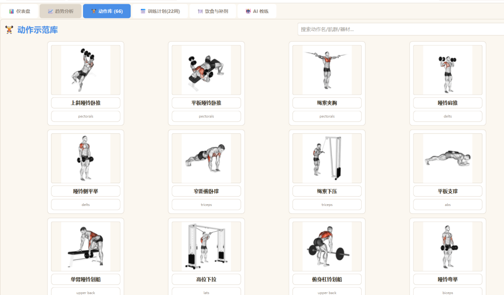
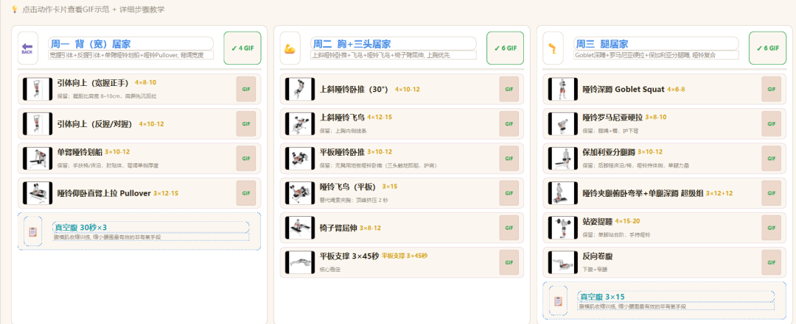
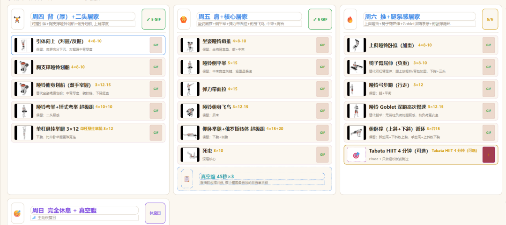
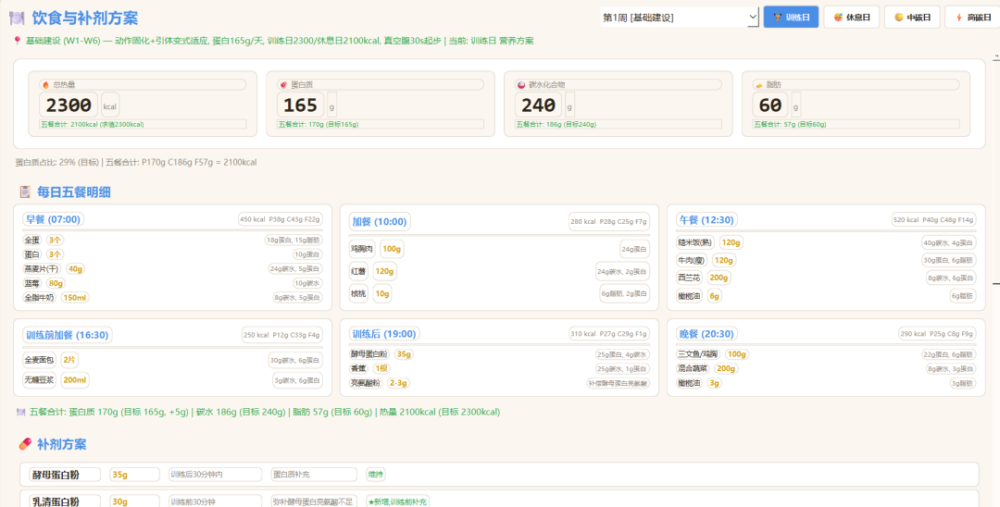
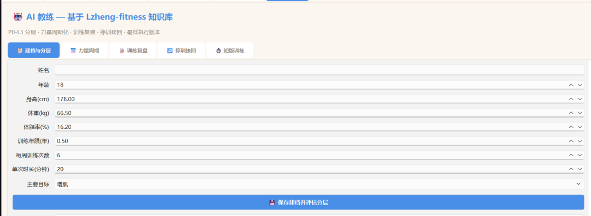
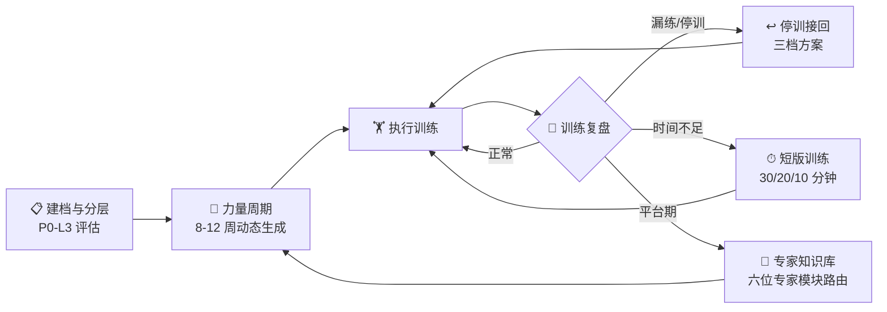
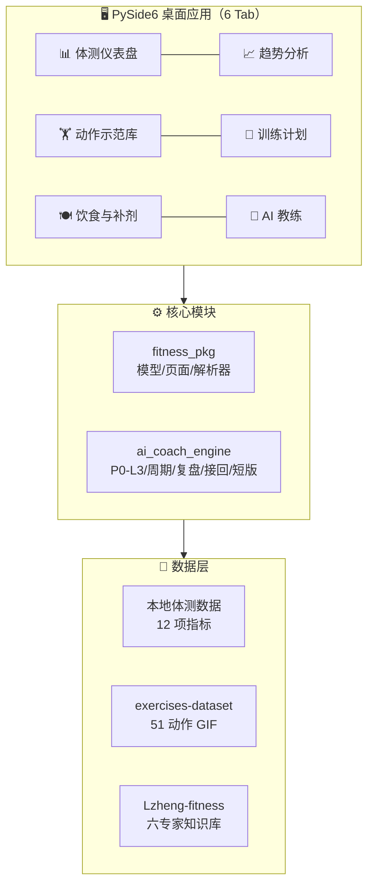

<div align="center">


# 健身监控 v9.0

**个人体脂体重监控 + 健身计划 + AI 教练**

*基于 Keep / Fitbod / Hevy / Strong 特性优化，深度集成 [Lzheng-fitness](https://github.com/yuppiez99999/Lzheng-fitness) 训练知识库*

[](https://github.com/yuppiez99999/fitness-tracker/releases)
[](https://www.python.org/)
[](#-快速开始)
[](https://doc.qt.io/qtforpython/)
[](#-许可证)
[](#-许可证)
[](https://github.com/yuppiez99999/fitness-tracker/stargazers)
[](https://github.com/yuppiez99999/fitness-tracker/issues)

**[功能亮点](#-功能亮点) · [界面预览](#-界面预览) · [AI 教练](#-ai-教练-v90-新增) · [快速开始](#-快速开始) · [架构](#-技术架构) · [知识库](#-lzheng-fitness-知识库) · [许可证](#-许可证)**

---

</div>

> ### v9.0 关键升级
> 深度集成 Lzheng-fitness 知识库（Schoenfeld / Helms / Aragon / Nuckols 蒸馏模块），新增 **AI 教练**页面：
>
> **P0-L3 分层评估** · **8-12 周动态力量周期化** · **训练复盘 + 渐进超负荷** · **停训接回三档方案** · **最低执行版本（30/20/10 分钟）**
>
> 支持 PyInstaller 一键封装为独立 .exe，免安装 Python 直接运行。

---

## ✨ 功能亮点

| 模块 | 功能 |
|:---|:---|
| 📊 **体测仪表盘** | 12 项体测指标 · 快速录入 · 历史记录 |
| 📈 **趋势分析** | 7 日 EMA 平滑曲线 · 目标达标日预测 · 体成分饼图 |
| 🏋️ **动作示范库** | 51 个动作 GIF 动画 · 中文步骤教学 · 肌群信息 |
| 📅 **训练计划** | 22 周宽背窄腰塑形 v2.1（三阶段周期化，6 练 1 休）· 点击动作看示范 |
| 🍽 **饮食与补剂** | 三阶段营养方案 · 五餐明细 · 补剂表 · 饮水指南 |
| 🤖 **AI 教练** | 基于 Lzheng-fitness 知识库的增肌规划系统（5 个子功能） |

---

## 🖼️ 界面预览

### 🏋️ 动作示范库
<p align="center">
  
</p>

> 66 个动作的网格卡片布局，支持按动作名 / 肌群 / 器材搜索，点击卡片即可查看 GIF 示范与详细步骤教学。

---

### 📅 训练计划（22 周周期化）

<p align="center">
  
</p>

<p align="center">
  
</p>

> 6 练 1 休的完整周期安排：背（宽）→ 胸 + 三头 → 腿 → 背（厚）+ 二头 → 肩 + 核心 → 推 + 腿泵感 → 完全休息。每日动作带 GIF 预览、组数次数标注与替代方案说明。

---

### 🍽 饮食与补剂方案

<p align="center">
  
</p>

> 训练日 / 休息日差异化热量结构，实时追踪蛋白质、碳水、脂肪三大宏量。五餐明细含精确克数与热量标注，补剂方案按训练前后时段智能推荐。

---

### 🤖 AI 教练

<p align="center">
  
</p>

> 基于 Lzheng-fitness 六位专家知识库的纯本地智能规划。建档后自动评估 P0-L3 训练阶段，生成个性化力量周期、训练复盘与停训接回方案。

---

## 🤖 AI 教练 (v9.0 新增)

集成 Lzheng-fitness 的 6 位顶级训练专家知识（Alan Aragon、Brad Schoenfeld、Brukner & Khan、Dan John、Eric Helms、Greg Nuckols），**纯 Python 实现，离线运行，无需 AI 对话**。

| 子功能 | 说明 |
|:------|:-----|
| 📋 建档与分层 | P0-L3 四级训练阶段评估（启动/动作稳定/周管理/阶段进步） |
| 📅 力量周期 | 8-12 周动态周期生成（积累→强度→实现→减量），含顶组+回退组 |
| 📝 训练复盘 | 单次训练复盘 + 渐进超负荷决策（双重渐进：先加次再加重） |
| ↩️ 停训接回 | 三档接回方案（正常/降级/最低）+ 未来 7 天安排 |
| ⏱ 短版训练 | 30/20/10 分钟最低执行版本，保留主线，不补课不加倍 |



---

## 🚀 快速开始

### 方式一 · 免安装运行（推荐）

直接下载已封装的独立程序，无需安装 Python：

1. 前往 [Releases](https://github.com/yuppiez99999/fitness-tracker/releases) 或克隆仓库获取 `dist\健身监控v9.0\` 目录
2. 复制到任意 Windows 电脑
3. 双击 `健身监控v9.0.exe` 即可运行

### 方式二 · 源码运行

- Python 3.8+
- 建议使用虚拟环境运行，避免全局包冲突

```bash
# 克隆仓库（含子模块）
git clone --recurse-submodules https://github.com/yuppiez99999/fitness-tracker.git
cd fitness-tracker

# 创建虚拟环境
python -m venv .venv
.venv\Scripts\Activate.ps1

# 安装依赖
pip install PySide6 matplotlib pandas numpy Pillow

# 直接运行
python 体脂体重监控_完整版.py
```

也可双击 `启动体脂体重监控.bat` 一键启动（Windows）。

### 封装为独立 .exe

```bash
pip install pyinstaller
python -m PyInstaller 健身监控.spec --noconfirm --clean
# 产物: dist\健身监控v9.0\健身监控v9.0.exe
```

---

## 🏗️ 技术架构



| 类别 | 技术 |
|:-----|:-----|
| GUI 框架 | PySide6 |
| 数据/绘图 | matplotlib · pandas · numpy · Pillow |
| 打包分发 | PyInstaller |
| 数据源 | [exercises-dataset](https://github.com/yuppiez99999/exercises-dataset)（Git 子模块） |
| 知识库 | [Lzheng-fitness](https://github.com/yuppiez99999/Lzheng-fitness)（Git 子模块） |
| 舆情分析 | [BettaFish / MiroFish](https://github.com/yuppiez99999/MiroFish)（Git 子模块） |

---

## 🧠 AI 教练知识来源

Lzheng-fitness 知识库包含 6 个来源限定专家模块：

| 专家 | 领域 | 应用场景 |
|:-----|:-----|:---------|
| Brad Schoenfeld | 肌肥大科学 | 训练量、频率、RIR 设置 |
| Eric Helms | 训练金字塔 | 周期结构、阶段过渡 |
| Alan Aragon | 营养策略 | 热量缺口、宏量配比 |
| Greg Nuckols | 力量停滞 | 突破平台期、变量实验 |
| Dan John | 基础训练 | 目标脱节时回到基础 |
| Brukner & Khan | 临床运动 | 安全筛查、疼痛分流 |

---

## 📚 Lzheng-fitness 知识库

> 详细说明见子模块 `Lzheng-fitness/README.md`。本仓库以 Git 子模块方式集成，克隆时请用 `--recurse-submodules`。

可独立下载、离线运行的个人训练 Agent Skills。v2 将计划、专项周期、训练复盘、停训接回、系统总控与健身工作台组合为一个可迁移的本地训练闭环。公开包不含任何个人训练数据、账号信息或绝对路径。

| Skill | 用途 |
| --- | --- |
| `lzheng-fitness-plan` | 训练建档、安全筛查、完整计划与 HTML |
| `lzheng-training-return` | 停训、漏练或条件变化后的接回 |
| `lzheng-strength-cycle-planner` | 单个力量动作的 8—12 周周期 |
| `lzheng-strength-training-review` | 单次、滚动、基准与周训练复盘 |
| `lzheng-training-expert-library` | 六个来源限定专家模块、选择协议和验证状态 |
| `lzheng-training-system` | 新电脑初始化、迁移、诊断、升级保护和整套校验 |
| `lzheng-fitness-workbench-builder` | 从计划、复盘和可选动态数据生成响应式离线工作台 |

安装（需 Python 3.10+，无需第三方包）：

```bash
python Lzheng-fitness/tools/install.py --platform codex --all
```

安装完成后，在新对话中说"**开始建立我的健身系统。**"即可由 AI 引导完成建档、动作重量校准、正式计划与工作台。发布前可用 `python Lzheng-fitness/tools/validate_bundle.py` 验证（检查元数据、链接、隐私残留与脚本语法）。

---

## 📋 训练计划模板亮点

<details open>
<summary><b>22 周宽背窄腰塑形计划（通用模板，点击收起）</b></summary>

所有身体数据均为占位示例，使用前请按个人体测值替换，热量与训练量可按自身 TDEE 调整。

| 维度 | 模板基线 | 模板优化 |
|:-----|:---------|:---------|
| 热量结构 | 单一缺口 | 训练日 / 休息日差异化热量 |
| 背周总量 | 30 组 | 18–22 组（周一 10 + 周四 8–12） |
| 俯身划船 | 周四主项 | T 杠划船 / 胸支撑划船（护腰） |
| 阿诺德推举 | 肩日主项 | 坐姿哑铃肩推（护肩袖） |
| 空腹有氧 | Phase 2 启动 | Phase 1 完全不做，Phase 2 最多 2 次 |
| 补剂 | 堆叠 9 种 | 精简至 5 必需 + 3 建议 |
| 真空腹 | 60 秒 ×5 | 30→45→60 秒递进 |

**训练日程（6 练 1 休）**：背（宽）→ 胸（上胸优先）→ 腿（四头为主）→ 背（划船）→ 肩 + 臂 → 全身 HIIT + 冲刺 → 完全休息。

</details>

---

## 📁 项目结构

<details>
<summary><b>展开目录树</b></summary>

```
06_个人辅助工具/
├── 体脂体重监控_完整版.py           # 主程序入口（PySide6 GUI，6 个 Tab）
├── fitness_modules.py               # 核心模块（模型/页面/解析器/教程/AI教练页面）
├── ai_coach_engine.py               # AI 教练引擎（P0-L3/周期/复盘/接回/短版）
├── 健身监控.spec                     # PyInstaller 打包配置
├── fitness_icon.ico                 # 应用图标
├── 启动体脂体重监控.bat             # Windows 一键启动脚本
├── Lzheng-fitness/                  # 知识库子模块（Schoenfeld/Helms 等 6 专家）
├── generate_report.py               # 报告生成工具
├── 补充缺失数据.py                   # 体测数据补全脚本
├── .venv/                           # 虚拟环境（不提交）
├── BettaFish/                       # 舆情分析子模块（Git 子模块）
├── exercises-dataset/               # 动作数据集子模块（Git 子模块）
├── dist/                            # 封装产物（仅 exe 本体随仓库分发）
│   └── 健身监控v9.0/
│       └── 健身监控v9.0.exe          # PyInstaller 封装的可执行程序
├── 体重体脂监控/                     # 训练计划与资源
│   ├── 训练计划文档（.md）            # 个人训练计划（本地个人数据，不提交）
│   ├── ai_coach/                    # AI 教练数据（本地个人数据，不提交）
│   ├── exercises_gif/               # 51 个动作示范 GIF
│   ├── exercises_matched.json       # 动作与 GIF 映射
│   ├── match_exercises.py           # 动作匹配脚本
│   ├── 报告/                         # 体测报告 TXT（本地个人数据，不提交）
│   └── 图表/                         # 趋势图 PNG（本地个人数据，不提交）
└── README.md
```

</details>

---

## 📊 数据说明

<details>
<summary><b>展开数据指标与存储说明</b></summary>

- 体测数据支持 12 项指标：日期、体重、体脂率、肌肉量、内脏脂肪等级、基础代谢率、体水分率、骨量、BMI、骨骼肌率、腰围、臀围
- AI 教练数据存储在 `体重体脂监控/ai_coach/`（建档、周期 JSON、复盘记录、周期 MD），该目录为本地个人数据，不随仓库分发
- 个人训练计划文档（`体重体脂监控/*.md`）含个人执行数据，同样仅保存在本地，不随仓库分发
- 目标体重 / 目标体脂率可在建档时自定义
- 变化值以"当前 - 初始"计算，降低会显示为负数

</details>

---

## ⚠️ 注意事项

- 本项目为个人健身工具，数据存储在本地
- 敏感个人信息（体测记录、训练计划、AI 教练数据）已排除在版本控制与 Git 历史之外
- 虚拟环境目录 `.venv` 不提交到仓库
- 训练计划文档中的身体数据均为通用示例，使用前请替换为个人体测值
- AI 教练提供一般训练规划支持，不作医疗诊断或康复建议

---

## 📄 许可证

<div align="center">

**PolyForm Noncommercial License 1.0.0**

**非商业用途 · 必须署著作名**

</div>

| | |
|:---|:---|
| ✅ **允许** | 个人使用 · 学习研究 · 兴趣项目 · 修改自用 · 非商业组织使用 · 学术引用 |
| ❌ **禁止** | 商业产品/服务 · 企业商业运营 · 付费分发 · 商业 AI 训练 · 移除署名 · 再许可 |
| ✍️ **署名** | 分发时必须原样保留以下署名行与许可证全文/URL |

```text
Required Notice: Copyright (c) 2026 yuppiez99999 (https://github.com/yuppiez99999)
```

完整法律文本见 [`LICENSE`](./LICENSE)，完整条款说明见下方折叠：

<details>
<summary><b>📖 查看完整许可证条款（授权范围 / 非商业定义 / 子模块边界 / MIT 差异 / 引用格式）</b></summary>

### 授权范围（允许）

| 用途 | 是否允许 | 说明 |
|:-----|:---------|:-----|
| 个人健身记录、体测追踪 | ✅ | 本软件的原始设计目的 |
| 个人学习、研究、实验 | ✅ | 不含任何预期商业应用 |
| 兴趣项目、业余爱好、私人娱乐 | ✅ | PolyForm NC 明确列入 Personal Uses |
| 修改、二次开发、自用分支 | ✅ | 须保留署名与本许可证条款 |
| 慈善机构、教育机构、公共研究机构、政府机构使用 | ✅ | 无论资金来源均允许 |
| 公开分发源码或构建产物 | ✅ | 须附带本许可证全文与署名行 |
| 学术论文引用、教学示例 | ✅ | 须署名 |

### 禁止范围（不允许）

| 用途 | 是否允许 | 说明 |
|:-----|:---------|:-----|
| 任何直接或间接收费的商业产品或服务 | ❌ | 包括付费 App、SaaS、内嵌收费模块 |
| 企业内部商业运营、员工健身福利商业化产品 | ❌ | 商业实体内部使用须另行授权 |
| 二次开发后以商业方式发行或销售 | ❌ | 衍生作品继承非商业约束 |
| 用于训练商业 AI 模型或数据集 | ❌ | 衡生数据集同样受非商业约束 |
| 移除、隐藏或篡改署名行 `Required Notice` | ❌ | 违反 Notices 条款，许可证立即终止 |
| 重新许可（sublicense）或转让本许可证 | ❌ | PolyForm NC 明确禁止 |

> **商业授权**：如需将本软件用于商业用途，请通过 [GitHub Issues](https://github.com/yuppiez99999/fitness-tracker/issues) 联系作者另行签订商业许可协议。

### 署名要求（必须）

按 PolyForm NC 1.0.0 的 **Notices** 条款，分发本软件任意部分时必须同时附带：

1. **本许可证全文或其 URL**：`https://polyformproject.org/licenses/noncommercial/1.0.0`
2. **署名行（Required Notice）**，原样保留不得修改：
   ```
   Required Notice: Copyright (c) 2026 yuppiez99999 (https://github.com/yuppiez99999)
   ```
3. 若本软件附带了其他 `Required Notice:` 开头的纯文本行，须一并原样传递。

署名不得移除、隐藏、缩印或改写。在 About 对话框、README、启动画面、关于页等显著位置展示即视为满足"获得副本者同时获得署名"的要求。

### 非商业用途定义

PolyForm NC 1.0.0 中的"非商业"采用正向定义，**任何非商业目的均为许可目的**，具体包括：

- **个人使用**：研究、实验、为公共知识服务的测试、个人学习、私人娱乐、兴趣项目、业余追求、宗教活动，且无任何预期商业应用
- **非商业组织使用**：慈善组织、教育机构、公共研究机构、公共安全或健康机构、环境保护机构、政府机构，无论资金来源
- **合理使用（Fair Use）**：法律赋予的合理使用权利不受本条款限制

商业与否以"用途目的"为准，而非"使用者身份"。商业公司员工为个人健身记录使用本软件属非商业；个人开发者将本软件打包收费分发则属商业。

### 子模块许可证边界

本仓库含三个 Git 子模块，**它们各自保留原许可证**，主仓库 PolyForm NC 不覆盖子模块内部：

| 子模块 | 许可证 | 商业用途 | 署名要求 |
|:-------|:-------|:---------|:---------|
| [`Lzheng-fitness/`](./Lzheng-fitness/) | MIT | 允许 | 保留版权声明 |
| [`exercises-dataset/`](./exercises-dataset/) | 见子模块仓库 | 见子模块 LICENSE | 见子模块 LICENSE |
| [`BettaFish/`](./BettaFish/) | 见子模块仓库 | 见子模块 LICENSE | 见子模块 LICENSE |

**组合分发注意**：当主仓库代码与子模块代码一同分发时，主仓库部分受 PolyForm NC 约束（非商业 + 署名），子模块部分受各自原许可约束。若下游用途同时涉及两部分，须同时满足所有适用许可的最严格条款；任一子模块许可不放宽主仓库的非商业约束。

### 与原 MIT 许可的差异

本仓库 v9.0 之前采用 MIT 许可（允许商业用途、署名要求较弱）。自 v9.0 起切换至 PolyForm NC 1.0.0，主要变化：

| 维度 | 原 MIT | 现 PolyForm NC 1.0.0 |
|:-----|:-------|:---------------------|
| 商业用途 | 允许 | **禁止** |
| 署名要求 | 保留版权声明 | **强制 Required Notice 传递** |
| 子许可（sublicense） | 允许 | 禁止 |
| 专利授权 | 显式授予 | 显式授予（含专利防御条款） |
| 违规补救 | 无 | 32 天内纠正可续期 |
| 担保 | 无 | 无 |

历史版本（v8.x 及之前）在 MIT 下分发的副本仍受 MIT 约束，不溯及既往。

### 引用建议

学术论文或公开材料引用本软件时，建议格式：

```bibtex
@software{fitness_tracker_v9,
  author       = {yuppiez99999},
  title        = {健身监控 v9.0：个人体脂体重监控与 AI 教练},
  year         = {2026},
  url          = {https://github.com/yuppiez99999/fitness-tracker},
  license      = {PolyForm Noncommercial 1.0.0}
}
```

### 许可证文本来源

本许可证官方文本来自 [PolyForm Project](https://polyformproject.org/licenses/noncommercial/1.0.0)，© PolyForm Project Inc.。本仓库 `LICENSE` 文件为该官方文本的逐字副本，附加上述 Required Notice 署名行。

</details>

---

<div align="center">

**⭐ 如果这个项目对你有帮助，欢迎点一个 Star！**

[](https://star-history.com/#yuppiez99999/fitness-tracker&Date)


</div>
